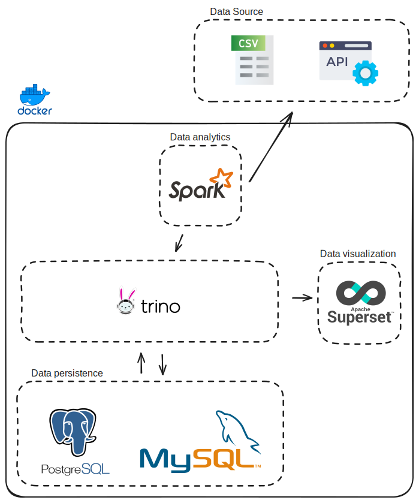

# Trino Environment Study
Esse projeto tem o objetivo de criar um ambiente local onde possamos acessar nossos dados persistidos através do [Trino](https://trino.io/).

---
## The Project


## Commands
Start project
``` bash
make up
```

</br>

Access Trino
``` bash
make it
```

</br>

Finish project
``` bash
make down
```

## Stages
- [x] Deploy Trino #1
- [x] Deploy Postgres
- [x] Connecting Trino on Postgres
- [ ] Deploy MySQL
- [ ] Deploy PySpark
- [ ] (ETL) Get data from Sources
- [ ] Deploy Superset
- [ ] Create Sample Dashboard on Superset
